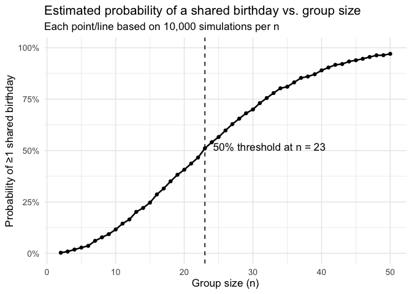
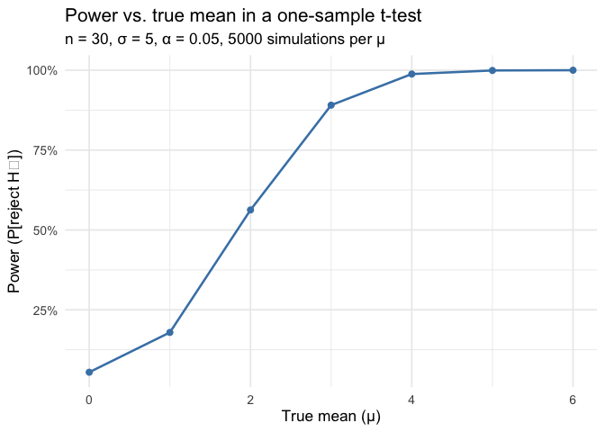
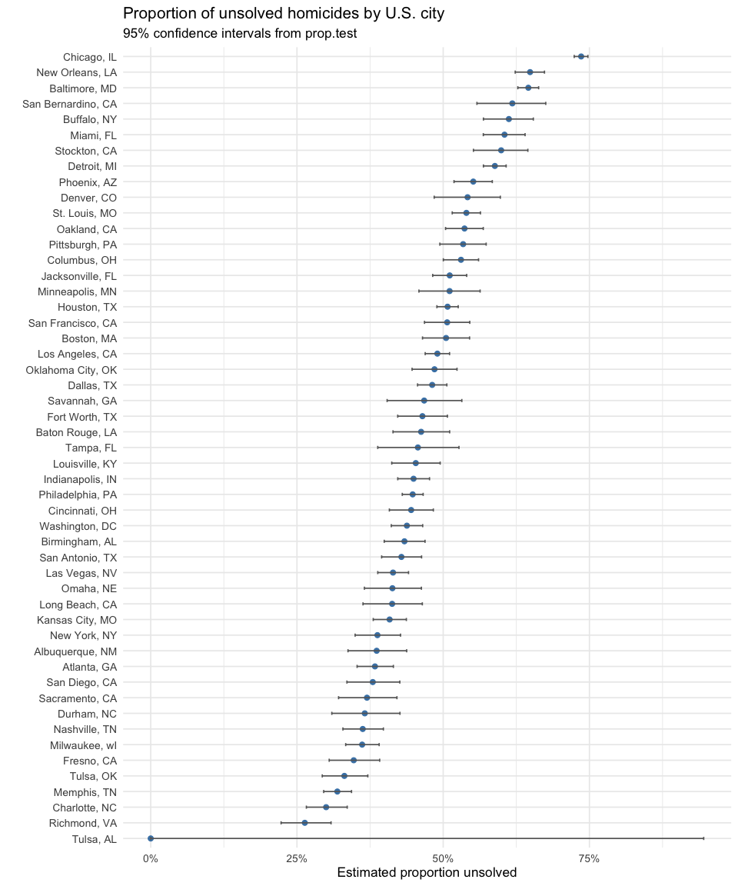

hw5_xw3107
================
2025-11-10

## Problem 1 — The birthday problem

We estimate the probability that a group of size $n$ (with birthdays
i.i.d. Uniform over 365 days, no leap years) has **at least one shared
birthday**.

``` r
# packages
library(janitor) 
library(tidyverse)
library(scales)
library(knitr)

set.seed(2025)  # reproducibility

# helper function
same_birthdat = function(n, days = 365) {
  # sample birthdays with replacement, then check for duplicates
  bdays = sample.int(days, size = n, replace = TRUE)
  any(duplicated(bdays))
}

# simulate
reps = 10000
n_grid = 2:50

sim_results =
  map_dfr(
    n_grid,
    \(n) tibble(
      n = n,
      # run the Bernoulli
      prob_shared = mean(replicate(reps, same_birthdat(n)))
    )
  )

# the smallest n where the probability exceeds 50%
n_threshold =
  sim_results |>
  filter(prob_shared >= 0.5) |>
  slice_min(n) |>
  pull(n)
```

``` r
ggplot(sim_results, aes(x = n, y = prob_shared)) +
  geom_line(size = 0.9) +
  geom_point(size = 1.5) +
  geom_vline(xintercept = n_threshold, linetype = 2) +
  annotate(
    "text",
    x = n_threshold + 1.2,
    y = 0.52,
    label = paste0("50% threshold at n = ", n_threshold),
    hjust = 0
  ) +
  scale_y_continuous(labels = percent_format(accuracy = 1), limits = c(0, 1)) +
  labs(
    x = "Group size (n)",
    y = "Probability of ≥1 shared birthday",
    title = "Estimated probability of a shared birthday vs. group size",
    subtitle = paste0("Each point/line based on ", format(reps, big.mark = ","), " simulations per n")
  ) +
  theme_minimal(base_size = 13)
```

    ## Warning: Using `size` aesthetic for lines was deprecated in ggplot2 3.4.0.
    ## ℹ Please use `linewidth` instead.
    ## This warning is displayed once every 8 hours.
    ## Call `lifecycle::last_lifecycle_warnings()` to see where this warning was
    ## generated.

<!-- -->

``` r
sim_results |>
  filter(n %in% c(2, 10, 20, 23, 30, 40, 50)) |>
  mutate(prob_shared = percent(prob_shared, accuracy = 0.1)) |>
  kable(col.names = c("n", "Estimated probability"))
```

|   n | Estimated probability |
|----:|:----------------------|
|   2 | 0.3%                  |
|  10 | 11.6%                 |
|  20 | 40.7%                 |
|  23 | 51.1%                 |
|  30 | 70.0%                 |
|  40 | 89.0%                 |
|  50 | 97.1%                 |

The probability of at least one shared birthday increases as the group
size grows, rising from near zero at small n to nearly 1 when n = 50.
Plus, the probability exceeds 50% at only 23 people, illustrating how
quickly collisions occur in the birthday problem despite there are 365
days a year.

## Problem 2

We explore how the **power** of a one-sample *t*-test changes with the
true mean $\mu$, holding the sample size and variance constant.

### Simulation design

1.  Generate $x_i \sim \text{Normal}(\mu, \sigma)$.
2.  Conduct a one-sample *t*-test for $H_0: \mu = 0$ at $\alpha = 0.05$.
3.  Record the sample mean $\hat{\mu}$ and the *p*-value.

``` r
library(broom)
library(knitr)

# import parameters
n = 30
sigma = 5
mu_values = 0:6
n_sims = 5000

# helper function run one t-test and tidy output 
simulate_ttest = function(mu) {
  x = rnorm(n, mean = mu, sd = sigma)
  tidy(t.test(x, mu = 0)) |>
    mutate(mu_hat = mean(x), mu_true = mu)
}

# run simulation
sim_results =
  map_dfr(mu_values, \(m) replicate(n_sims, simulate_ttest(m), simplify = FALSE)) |>
  bind_rows()

glimpse(sim_results)
```

    ## Rows: 35,000
    ## Columns: 10
    ## $ estimate    <dbl> -0.90873650, -0.13034448, 0.23803987, -0.44170271, 1.12194…
    ## $ statistic   <dbl> -0.80417733, -0.12874659, 0.25958330, -0.55706616, 1.49057…
    ## $ p.value     <dbl> 0.42783797, 0.89844692, 0.79701921, 0.58175655, 0.14686970…
    ## $ parameter   <dbl> 29, 29, 29, 29, 29, 29, 29, 29, 29, 29, 29, 29, 29, 29, 29…
    ## $ conf.low    <dbl> -3.2198870, -2.2009577, -1.6374513, -2.0633834, -0.4174804…
    ## $ conf.high   <dbl> 1.4024140, 1.9402688, 2.1135311, 1.1799780, 2.6613701, 0.2…
    ## $ method      <chr> "One Sample t-test", "One Sample t-test", "One Sample t-te…
    ## $ alternative <chr> "two.sided", "two.sided", "two.sided", "two.sided", "two.s…
    ## $ mu_hat      <dbl> -0.90873650, -0.13034448, 0.23803987, -0.44170271, 1.12194…
    ## $ mu_true     <int> 0, 0, 0, 0, 0, 0, 0, 0, 0, 0, 0, 0, 0, 0, 0, 0, 0, 0, 0, 0…

### power analysis

``` r
power_df =
  sim_results |>
  group_by(mu_true) |>
  summarise(power = mean(p.value < 0.05))

ggplot(power_df, aes(x = mu_true, y = power)) +
  geom_line(size = 0.9, color = "steelblue") +
  geom_point(size = 2, color = "steelblue") +
  scale_y_continuous(labels = scales::percent_format(accuracy = 1)) +
  labs(
    x = "True mean (μ)",
    y = "Power (P[reject H₀])",
    title = "Power vs true mean one-sample t-test",
    subtitle = paste0("n = ", n, ", σ = ", sigma, ", α = 0.05, ", n_sims, " simulations per μ")
  ) +
  theme_minimal(base_size = 13)
```

<!-- --> As the
true mean μ moves from 0 , the power of the test increases sharply: when
μ is close to 0 the test rejects only about 5–15% of the time, but by μ
around 3–4 the power is close to 100%. This shows the usual
relationship, larger true effects are much easier to detect with fixed n
and .

### Mean estimates and selection bias

``` r
mean_df =
  sim_results |>
  group_by(mu_true) |>
  summarise(
    mean_all = mean(mu_hat),
    mean_reject = mean(mu_hat[p.value < 0.05])
  )

ggplot(mean_df, aes(x = mu_true)) +
  geom_line(aes(y = mean_all, color = "All samples"), size = 1.1) +
  geom_line(aes(y = mean_reject, color = "Rejected H₀"), size = 1.1, linetype = 2) +
  geom_abline(slope = 1, intercept = 0, linetype = "dashed", color = "gray40") +
  scale_color_manual(values = c("All samples" = "steelblue", "Rejected H₀" = "tomato")) +
  labs(
    x = "True mean (μ)",
    y = "Average estimated mean (μ̂)",
    color = NULL,
    title = "Average estimated μ̂ vs. true μ",
    subtitle = "Dashed gray line: μ̂ = μ (perfect estimation)"
  ) +
  theme_minimal(base_size = 13)
```

<!-- --> The blue
line (all samples) lies almost exactly on the 45° line, indicating that
the sample mean is an approximately unbiased estimator of μ. The red
dashed line (only samples where H_0 is rejected) is above the 45° line
for small μ, meaning that among “significant” results the average
overestimates the true effect; this happens because we are conditioning
on rejection, which selects datasets where random noise has pushed
farther from 0 (a selection or “winner’s curse” bias). As μ gets large
and power approaches 1, almost all samples reject, so the red line
converges back to the blue line and the bias disappears.

# Problem 3

We analyze the **Washington Post homicide dataset** (50 U.S. cities).  
The raw data includes variables describing the victim, location, city,
state, and case disposition.

### Import and describe the raw data

``` r
library(broom)

# read directly from GitHub 
homicides =
  read_csv("https://raw.githubusercontent.com/washingtonpost/data-homicides/master/homicide-data.csv") |>
  clean_names()

glimpse(homicides)
```

    ## Rows: 52,179
    ## Columns: 12
    ## $ uid           <chr> "Alb-000001", "Alb-000002", "Alb-000003", "Alb-000004", …
    ## $ reported_date <dbl> 20100504, 20100216, 20100601, 20100101, 20100102, 201001…
    ## $ victim_last   <chr> "GARCIA", "MONTOYA", "SATTERFIELD", "MENDIOLA", "MULA", …
    ## $ victim_first  <chr> "JUAN", "CAMERON", "VIVIANA", "CARLOS", "VIVIAN", "GERAL…
    ## $ victim_race   <chr> "Hispanic", "Hispanic", "White", "Hispanic", "White", "W…
    ## $ victim_age    <chr> "78", "17", "15", "32", "72", "91", "52", "52", "56", "4…
    ## $ victim_sex    <chr> "Male", "Male", "Female", "Male", "Female", "Female", "M…
    ## $ city          <chr> "Albuquerque", "Albuquerque", "Albuquerque", "Albuquerqu…
    ## $ state         <chr> "NM", "NM", "NM", "NM", "NM", "NM", "NM", "NM", "NM", "N…
    ## $ lat           <dbl> 35.09579, 35.05681, 35.08609, 35.07849, 35.13036, 35.151…
    ## $ lon           <dbl> -106.5386, -106.7153, -106.6956, -106.5561, -106.5810, -…
    ## $ disposition   <chr> "Closed without arrest", "Closed by arrest", "Closed wit…

### We create a city_state variable and compute:

``` r
homicides_city =
  homicides |>
  mutate(
    city_state = paste0(city, ", ", state),
    unsolved = disposition %in% c("Closed without arrest", "Open/No arrest")
  ) |>
  group_by(city_state) |>
  summarise(
    total = n(),
    unsolved = sum(unsolved)
  )

homicides_city |> head()
```

    ## # A tibble: 6 × 3
    ##   city_state      total unsolved
    ##   <chr>           <int>    <int>
    ## 1 Albuquerque, NM   378      146
    ## 2 Atlanta, GA       973      373
    ## 3 Baltimore, MD    2827     1825
    ## 4 Baton Rouge, LA   424      196
    ## 5 Birmingham, AL    800      347
    ## 6 Boston, MA        614      310

### Baltimore, Estimate proportion unsolved using prop.test

``` r
baltimore =
  homicides_city |>
  filter(city_state == "Baltimore, MD")

balt_prop =
  prop.test(
    x = baltimore$unsolved,
    n = baltimore$total
  )

balt_tidy =
  tidy(balt_prop)

balt_tidy |>
  select(estimate, conf.low, conf.high)
```

    ## # A tibble: 1 × 3
    ##   estimate conf.low conf.high
    ##      <dbl>    <dbl>     <dbl>
    ## 1    0.646    0.628     0.663

### Now compute proportion + CI for each city

``` r
city_results =
  homicides_city |>
  mutate(
    test = map2(unsolved, total, \(x, n) prop.test(x = x, n = n)),
    test_tidy = map(test, tidy)
  ) |>
  unnest(test_tidy) |>
  select(city_state, total, unsolved, estimate, conf.low, conf.high)
```

    ## Warning: There was 1 warning in `mutate()`.
    ## ℹ In argument: `test = map2(unsolved, total, function(x, n) prop.test(x = x, n
    ##   = n))`.
    ## Caused by warning in `prop.test()`:
    ## ! Chi-squared approximation may be incorrect

``` r
city_results |> head()
```

    ## # A tibble: 6 × 6
    ##   city_state      total unsolved estimate conf.low conf.high
    ##   <chr>           <int>    <int>    <dbl>    <dbl>     <dbl>
    ## 1 Albuquerque, NM   378      146    0.386    0.337     0.438
    ## 2 Atlanta, GA       973      373    0.383    0.353     0.415
    ## 3 Baltimore, MD    2827     1825    0.646    0.628     0.663
    ## 4 Baton Rouge, LA   424      196    0.462    0.414     0.511
    ## 5 Birmingham, AL    800      347    0.434    0.399     0.469
    ## 6 Boston, MA        614      310    0.505    0.465     0.545

### Plot: estimated unsolved proportions + CIs by city

``` r
city_results |>
  mutate(city_state = fct_reorder(city_state, estimate)) |>
  ggplot(aes(x = estimate, y = city_state)) +
  geom_point(color = "steelblue", size = 2) +
  geom_errorbar(
    aes(xmin = conf.low, xmax = conf.high),
    width = 0.2,
    color = "gray40"
  ) +
  scale_x_continuous(labels = scales::percent_format(accuracy = 1)) +
  labs(
    x = "Estimated proportion unsolved",
    y = "",
    title = "Proportion of unsolved homicides by U.S. city",
    subtitle = "95% confidence intervals from prop.test"
  ) +
  theme_minimal(base_size = 13)
```

<!-- -->
